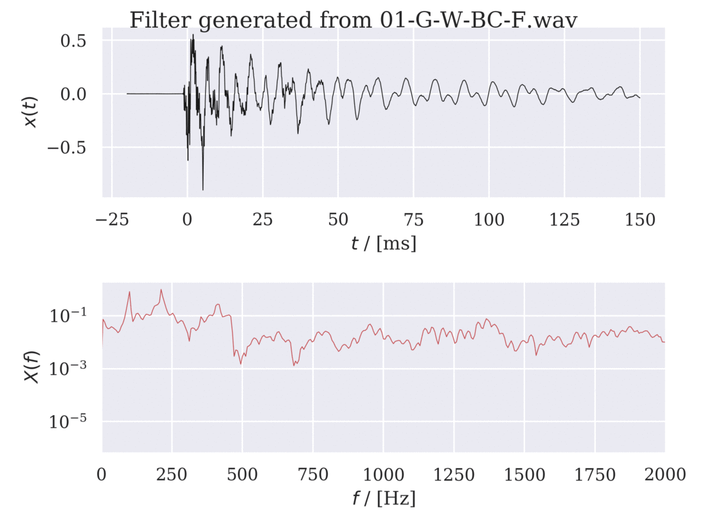

# FIR filter

This program generates [FIR-filters](https://en.wikipedia.org/wiki/Finite_impulse_response) from recorded *impulse reponses* and then uses them to filters given *samples*.

The primary use of this program is to create an FIR-filter to give an electric guitar sample the timbre of an acoustic guitar. However, the program can be used to filter any sample with any impulse recording.

This program is under the [MIT License](https://en.wikipedia.org/wiki/MIT_License).

## Examples

Eight impulse responses were recorded when a guitar was struck with an impulse hammer. The following FIR-filters were constructed from the recordings with the `create_fir_filter.py` program. See [Optimal_impulse_response_recording_methods_to_emulate_an_acoustic_guitar.pdf](https://github.com/axelstr/FIR_filter/blob/master/Optimal_impulse_response_recording_methods_to_emulate_an_acoustic_guitar.pdf) for the report.

The file [electric_guitar_chords.wav](https://github.com/axelstr/FIR_filter/blob/master/electric_guitar_chords.wav) is a direct recording of an electric guitar. With this program this signal is filtered to sound as an acoustic guitar. The result is the file [filtered_electric_guitar_chords.wav](https://github.com/axelstr/FIR_filter/blob/master/filtered_electric_guitar_chords.wav). **These files are best listened to at [this SoundCloud playlist](https://soundcloud.com/xeltrmberg/sets/fir_filter-examples).**

## Using the FIR filter program

### Installation

1. Please make the following libraries are installed with `Python 3.7`:
   - `numpy`
   - `scipy`
   - `os`
   - `sys`
   - `matplotlib`
   - `seaborn`
2. Download the following programs in this GitHub directory:
   - `create_fir_filter.py`
   - `filter_signals.py`

### Make recordings

The recordings could be in stereo or mono. Mono is prefered since the two channels will otherwise be merged. All recordings should be of the same sample rate, *44100 Hz* samplerate is recommended.

1. Record impulse resonses. For example:
   - Strike the bridge of an acoustic guitar with an impulse hammer and record the response inside or outside the guitar with a microphone.
   - Pop a ballon in the forest, a large hall or an open field. Record the response with a microphone.
   - *Note: This program assumes that the impulse resonse recording is silent before the impulse impact. It assumes the impulse impact is when the recorded amplitude first is .5 of what the maximum amplitude is in the recording. It then keeps 20  ms before that impact. This silent time can be changed by changing the value of the variable `silence_dur` in the `main` function in `create_fir_filter.py`.*
2. Record samples. For example:
   - Dry, direct recording of an electric guitar. Consider increasing the treble on the recording since the magnetic filters act like a lowpass filter.
   - Record while singing in a well isolated room.

### Manual

1. Place the two downloaded programs in a directory together with a folder `impulse_responses` and `samples` se section <u>Tree structure of directories</u> for detailed description.
2. Generate FIR-filters.
   1. In the directory `impulse_responses` place the recorded impulse resonses.
   2. Run the program `create_fir_filter.py` inside the directory above. The prompt will now show you the impulse response recordings it has found. Enter the desired duration of the FIR filters in ms. The recomended duration for an acoustic guitar is *150  ms​*.
   3. The generated filters will be stored as `.wav` files in a new directory named `FIR_filter` together with corresponding `.png` files that show the plot of the FIR-singal. 
3. Filter the samples.
   1. In the directory `samples` place the recorded samples.
   2. Run the program `filter_samples.py` inside the directory above. 
   3. The filtered samples will be stored as `.wav` files in a new directory named `filtered_samples`.

## Tree structure of directories

The following is a description of the tree structure (not alphabetized) of all directories when the programs have been executed:

- [ ] `FIR_filter_synthesis`
  - [ ] `impules_responses`
    - `impulse_response_1.wav`
    - *...*
  - [ ] `samples`
    - `sample_1.wav`
    - *...*
  - [ ] `FIR_filters`
    - [ ] `150_ms`
      - `impulse_response_1.wav`
      - `impulse_response_1.png` 
    - [ ] *...*
  - [ ] `filtered_samples`
    - [ ] `150_ms`
      - [ ] `sample_1.wav`
        - `impulse_response_1.wav`
        - *...*
      - [ ] *...*
    - [ ] *...*
  - `create_fir_filter.py`
  - `filter_samples.py`
